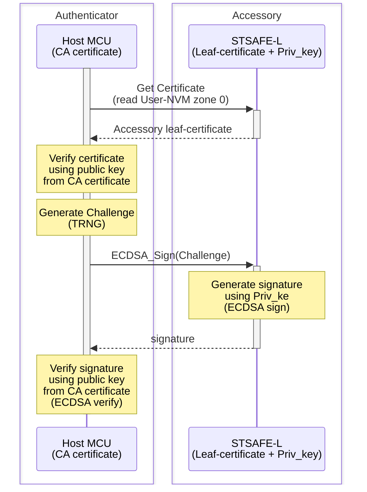
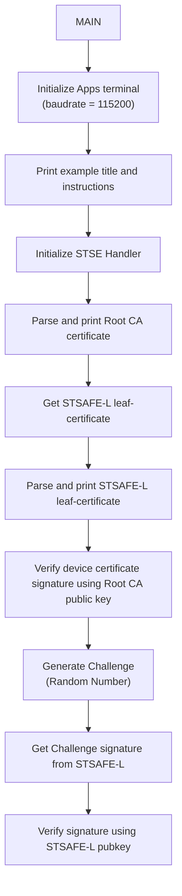

# STSAFE-L Accessory authentication

This project illustrates how to use the STSAFE-L Secure Element and STMicroelectronics Secure Element Library to perform device/accessory authentication. 
When loaded on the target MCU platform , the project performes an STSAFE-L authentication. 
This authentication scheme is typicaly used in accessories authentication use cases.

The example applicative flowchart is illustrated below :

STSELib API used in the example are the following :

- stse_init
- stse_certificate_parse
- stse_certificate_print_parsed_cert
- stse_certificate_get_key_type
- stse_certificate_verify_signature
- stse_certificate_is_parent
- stse_ecc_generate_signature

## Hardware and Software Prerequisites

- [NUCLEO-L452RE - STM32L452RE evaluation board](https://www.st.com/en/evaluation-tools/nucleo-l452re.html)

- [X-NUCLEO-ESE01A1 - STSAFE-L010 Secure element expansion board](https://www.st.com/en/evaluation-tools/x-nucleo-ese02a1.html)

- [STM32CubeIDE - Integrated Development Environment for STM32](https://www.st.com/en/development-tools/stm32cubeide.html)

- Serial terminal PC software  (i.e. Teraterm)

## Getting started with the project

- Connect the [X-NUCLEO-ESE02A1](https://www.st.com/en/evaluation-tools/x-nucleo-ese02a1.html) expansion board on the top of the [NUCLEO-L452RE](https://www.st.com/en/evaluation-tools/nucleo-l452re.html) evaluation board.

- Connect the board to the development computer and Open and configure a terminal software as follow (i.e. Teraterm).

- Open the STM32CubeIDE projects located in Application/STM32CubeIDE

- Build the project by clicking the “**Build the active configurations of selected projects\ **” button and verify that no error is reported by the GCC compiler/Linker.

- Launch a debug session then wait the debugger to stop on the first main routine instruction and press Start button to execute the main routine.

> [!NOTE]
> - Power configuation Jumper must be set to 3V3-VCC.
> - The COM port can differ from board to board. Please refer to windows device manager.

<b>Result</b> :

This project reports execution log through the on-board STLINK CDC bridge.
These logs can be analyzed on development computer using a serial terminal application (i.e.: Teraterm).
As example below.

<pre>

----------------------------------------------------------------------------------------------------------------
-                          STSAFE-L010 Multi-Steps Device Authentication Example                               -
----------------------------------------------------------------------------------------------------------------
- This example illustrates STSAFE-L010 device authentication process using Multi-Step approach.                -
- it can be taken as reference for building distant server authentication use cases.                           -
----------------------------------------------------------------------------------------------------------------
 - Initialize target STSAFE-L010

## CA self-signed certificate :

         x509 Version: 3
        SerialNumber: 01
         Issuer:
                 CountryName: NL
                 OrganizationalName: STMicroelectronics nv
                 CommonName: STM_STSAFE-L_CA0001
         Subject:
                 CountryName: NL
                 OrganizationalName: STMicroelectronics nv
                 CommonName: STM_STSAFE-L_CA0001
         Validity:
                 Not Before: 2024-06-07 00:00:00
                 Not After:  2054-06-07 00:00:00
         SignatureAlgorithm: eddsa-with-SHA256
         tbsSignature: eddsa-with-SHA256
         EllipticCurve: ed25519
         Cert PubKey (Compressed):
                 X: 8447F2C098BE15F605C698D5FAC57B560F1CCF1F379FE988AA2FEAA293B5DED1
         Cert Signature:
                 r: 2931A86FED6FD7548A032072845D778797E2364B5265EAC1BF7B393605755B5D
                 s :7619FD329CFD909317F953B4B821DF9CE20DA7CD745B9EF1ABF7949F4AB0FB05
         List of Extensions:
                 BasicConstraints: CA certificate.
                 KeyUsage: keyCertSign

## Target STSAFE-Axxx certificate :

         x509 Version: 3
        SerialNumber: 400000002252660113
         Issuer:
                 CountryName: NL
                 OrganizationalName: STMicroelectronics nv
                 CommonName: STM_STSAFE-L_CA0001
         Subject:
                 CountryName: IT
                 OrganizationalName: STMicroelectronics nv
                 CommonName: STSAFE-L010-GEN-400000002252660113
         Validity:
                 Not Before: 2025-08-01 05:46:46
                 Not After:  2055-08-01 05:46:46
         SignatureAlgorithm: eddsa-with-SHA256
         tbsSignature: eddsa-with-SHA256
         EllipticCurve: ed25519
         Cert PubKey (Compressed):
                 X: 1E8CC023CB5E9BBC64F9BEFAF46B2F4C65401A98C450C98096EBBF5EBB127416
         Cert Signature:
                 r: 84C4E9B917449B8BAE27557142DFEF3F1C3AEFAD349A6EED5DC1527DA3CD0BD1
                 s :6F02D92E25F919F4AF406DB02EBA0E7D4702EBA8485EF5371735BC28C0ADBD03
         List of Extensions:

## Device Certificate Verified

## Host random challenge :

  0xDB 0x41 0xA3 0x08 0xBD 0x3D 0xB9 0xBE 0x41 0x0F 0x19 0x92 0xC2 0xFB 0xBD 0x2A

## Device signature over Host challenge:
  0x7A 0x99 0xC5 0xCC 0x0B 0x2A 0xE5 0xAF 0x07 0xCC 0x18 0xF8 0xB3 0x44 0x00 0x58
  0xB6 0x4A 0x36 0xA3 0x9C 0xD0 0xC7 0x87 0x1F 0x53 0x0E 0xB3 0xDB 0x3E 0x01 0xD4
  0x2B 0xF0 0x47 0x70 0x6F 0x1B 0xE1 0x65 0xCD 0x93 0xC2 0x99 0xCE 0x12 0x18 0xC7
  0x4F 0x5E 0xC7 0x54 0x75 0x4B 0xD2 0x17 0x5A 0x13 0xF7 0xC7 0x4B 0xA2 0xC4 0x02

 ## Device Authenticated (Challenge signature verified successfully)

*#*# STMICROELECTRONICS #*#*
</pre>
