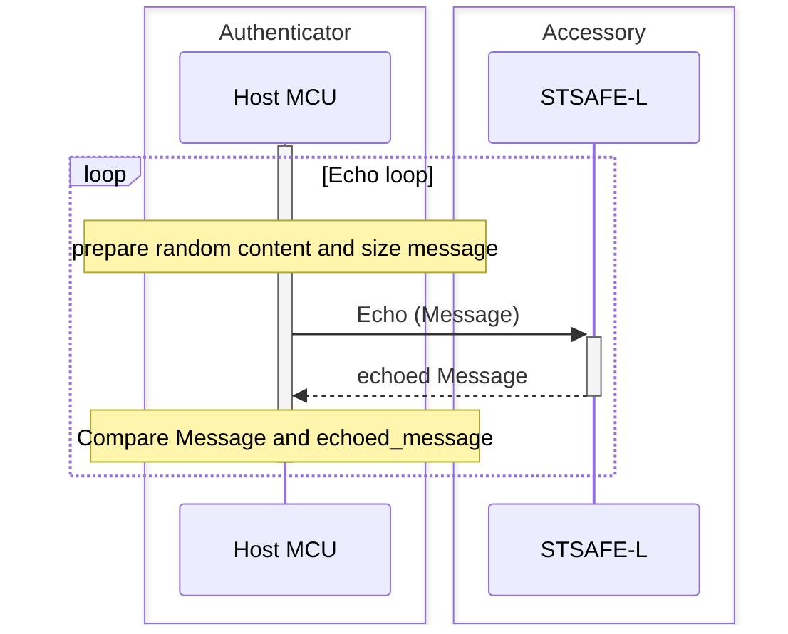
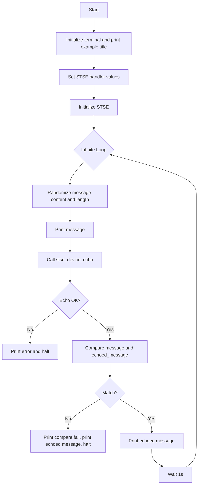

# STSAFE-L Echo Example

This project illustrates how to use the STSAFE-L Secure Element and STMicroelectronics Secure Element Library to perform an echo loop between Host and STSAFE-L Secure Element. 
Echo loop scenario is usefull for :
- SE integration and stability test
- Accessory hot-plug/presence detection

The example applicative flowchart is illustrated below :

STSELib API used in the example are the following :

- stse_init
- stse_echo

## Hardware and Software Prerequisites

- [NUCLEO-L452RE - STM32L452RE evaluation board](https://www.st.com/en/evaluation-tools/nucleo-l452re.html)

- [X-NUCLEO-ESE02A1 - STSAFE-L010 Secure element expansion board](https://www.st.com/en/evaluation-tools/x-nucleo-ese02a1.html)

- [STM32CubeIDE - Integrated Development Environment for STM32](https://www.st.com/en/development-tools/stm32cubeide.html)

- Serial terminal PC software  (i.e. Teraterm)

## Getting started with the project

- Connect the [X-NUCLEO-ESE02A1](https://www.st.com/en/evaluation-tools/x-nucleo-ese02a1.html) expansion board on the top of the [NUCLEO-L452RE](https://www.st.com/en/evaluation-tools/nucleo-l452re.html) evaluation board.

- Connect the board to the development computer and Open and configure a terminal software as follow (i.e. Teraterm).

- Open the STM32CubeIDE projects located in Application/STM32CubeIDE

- Build the project by clicking the “**Build the active configurations of selected projects\ **” button and verify that no error is reported by the GCC compiler/Linker.

- Launch a debug session then wait the debugger to stop on the first main routine instruction and press Start button to execute the main routine.

> [!NOTE]
> - Power configuation Jumper must be set to 3V3-VCC.
> - The COM port can differ from board to board. Please refer to windows device manager.

<b>Result</b> :

This project reports execution log through the on-board STLINK CDC bridge.
These logs can be analyzed on development computer using a serial terminal application (i.e.: Teraterm).
As example below.

<pre>
----------------------------------------------------------------------------------------------------------------
-                                    STSAFE-A Echo loop example                                                -
----------------------------------------------------------------------------------------------------------------
 - Initialize target STSAFE-A120
 ## Message :

  0xAB 0xAF 0x30 0x9A 0x76 0x55 0xFB 0xF4 0xC6 0xAE 0xDE 0x29 0x3B 0x81 0x0E 0x8A
  0x71 0xF7 0xEC 0xE2 0x2E 0x93 0x35 0x2B 0xB4 0x61 0xD7 0x06 0x45 0x94 0xD8 0x89
  0x1B 0x63 0x6D 0x80 0xC2 0xA1 0x8A 0x03 0x8C 0x8C 0x16 0xC8 0x30 0xB2 0x3D 0xA8
  0xB8 0xA4 0x54 0x86 0xFE 0xD8 0x4D 0x3C 0x04 0x5B 0xA0 0x97 0xE1 0x45 0x6A 0xC3
  0x6A 0xB9 0xB9 0x97 0x80 0x36 0xFB 0xF9 0xAF 0x78 0xC9 0x6B 0x38 0x35 0x78 0x7B
  0xA5 0x08 0x9E 0xC4 0x9D 0x8F 0xF3 0x04 0x4A 0xCB 0xA8 0x5A 0xAE 0xA3 0x0E 0x7C
  0x3F 0x9F 0xBF 0xE7 0x4D 0x3B 0xCC 0x57 0xAA 0x47 0x98 0x95 0x6C 0xB6 0x4D 0x36
  0x4E 0xBD 0xEF 0x1D 0x51 0x8D 0xA7 0xD7 0x1F 0x98 0x2F 0xF9 0x4D 0xAF 0xE5 0x1E
  0x17 0xEF 0x08 0xAF 0xAB 0xBF 0xFB 0x74 0x8E 0x20 0xEE 0x46 0x7D 0x3C 0xB4 0xAE
  0xDD 0x00 0xC6 0xFD 0xF7 0x04 0x07 0x5B 0x04 0xDA 0xAB 0x4C 0x17 0xFF 0x43 0xF0
  0x44 0x2C 0xE4 0x23 0x16 0x19 0x9D 0xEB 0xF0 0x81 0xE7 0xCD 0x2C 0x8B 0x35 0xEC
  0x22 0xD5 0x9A 0x95 0x8A 0xE5 0xFB 0x84 0x76 0xBC 0x01 0x2B 0xE1 0xFE 0xE4 0x94
  0xA1 0x57 0x5D 0x13 0x00 0x61 0x93 0xCF 0x09 0xEE 0x94 0xE7 0xA5 0x7B 0x24 0x53
  0x9F 0x90 0xC7 0x13 0xA1 0xCF 0xD7 0x74 0x00 0xB0 0x89 0xB5 0xFC 0x94 0x9F 0x70
  0xCD 0x41 0x1A 0x02 0xBF 0xA5 0x99 0xF9 0xC3 0x04 0x7E 0xFA 0xD3 0x0D 0xDB 0xB0
  0x9C 0xB2 0x0D 0xD0 0x40 0x05 0x81 0x24 0x40 0x2E 0xF1 0x3D

 ## Echoed Message :

  0xAB 0xAF 0x30 0x9A 0x76 0x55 0xFB 0xF4 0xC6 0xAE 0xDE 0x29 0x3B 0x81 0x0E 0x8A
  0x71 0xF7 0xEC 0xE2 0x2E 0x93 0x35 0x2B 0xB4 0x61 0xD7 0x06 0x45 0x94 0xD8 0x89
  0x1B 0x63 0x6D 0x80 0xC2 0xA1 0x8A 0x03 0x8C 0x8C 0x16 0xC8 0x30 0xB2 0x3D 0xA8
  0xB8 0xA4 0x54 0x86 0xFE 0xD8 0x4D 0x3C 0x04 0x5B 0xA0 0x97 0xE1 0x45 0x6A 0xC3
  0x6A 0xB9 0xB9 0x97 0x80 0x36 0xFB 0xF9 0xAF 0x78 0xC9 0x6B 0x38 0x35 0x78 0x7B
  0xA5 0x08 0x9E 0xC4 0x9D 0x8F 0xF3 0x04 0x4A 0xCB 0xA8 0x5A 0xAE 0xA3 0x0E 0x7C
  0x3F 0x9F 0xBF 0xE7 0x4D 0x3B 0xCC 0x57 0xAA 0x47 0x98 0x95 0x6C 0xB6 0x4D 0x36
  0x4E 0xBD 0xEF 0x1D 0x51 0x8D 0xA7 0xD7 0x1F 0x98 0x2F 0xF9 0x4D 0xAF 0xE5 0x1E
  0x17 0xEF 0x08 0xAF 0xAB 0xBF 0xFB 0x74 0x8E 0x20 0xEE 0x46 0x7D 0x3C 0xB4 0xAE
  0xDD 0x00 0xC6 0xFD 0xF7 0x04 0x07 0x5B 0x04 0xDA 0xAB 0x4C 0x17 0xFF 0x43 0xF0
  0x44 0x2C 0xE4 0x23 0x16 0x19 0x9D 0xEB 0xF0 0x81 0xE7 0xCD 0x2C 0x8B 0x35 0xEC
  0x22 0xD5 0x9A 0x95 0x8A 0xE5 0xFB 0x84 0x76 0xBC 0x01 0x2B 0xE1 0xFE 0xE4 0x94
  0xA1 0x57 0x5D 0x13 0x00 0x61 0x93 0xCF 0x09 0xEE 0x94 0xE7 0xA5 0x7B 0x24 0x53
  0x9F 0x90 0xC7 0x13 0xA1 0xCF 0xD7 0x74 0x00 0xB0 0x89 0xB5 0xFC 0x94 0x9F 0x70
  0xCD 0x41 0x1A 0x02 0xBF 0xA5 0x99 0xF9 0xC3 0x04 0x7E 0xFA 0xD3 0x0D 0xDB 0xB0
  0x9C 0xB2 0x0D 0xD0 0x40 0x05 0x81 0x24 0x40 0x2E 0xF1 0x3D

*#*# STMICROELECTRONICS #*#*
</pre>
